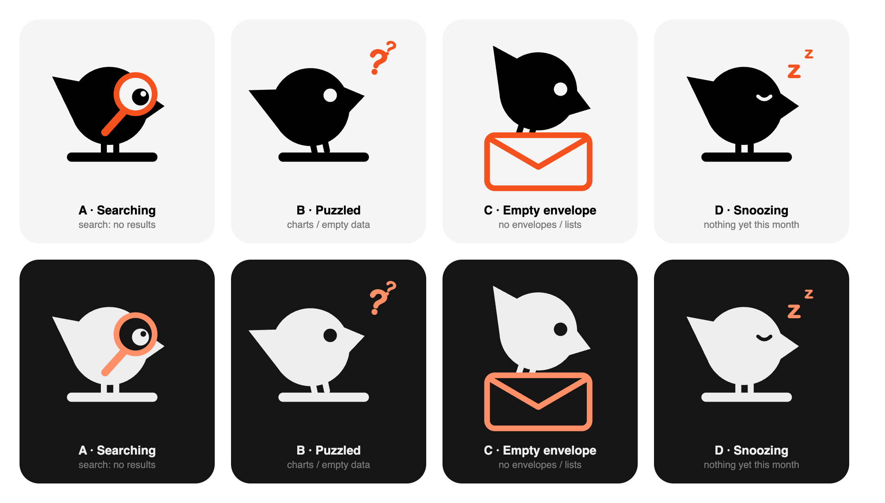

# Empty states: the Aviary bird mascot

Every empty state uses the Aviary bird (`src/components/splash/birdPath.ts`) as a
mascot. The bird never changes shape. Only its expression and one prop change, so
each empty state reads as the same character reacting to the situation.

## Rules

- Bird, legs and perch use `tokens.text`. Props (lens, `?`, `z`, envelope) use `tokens.accent`.
- The eye is a cut-out. When it isn't a hole in the path, draw it in the surface
  color (`tokens.cardSolid` on cards) so it still reads as one.
- Built from the 512-unit bird artboard, rendered with `viewBox="40 40 460 460"`
  so the props have room.
- Decorative only: hidden from screen readers. The copy next to it carries the meaning.
- Copy follows `CLAUDE.md` voice rules: short, second person, contractions, no em dashes.

## The family

| Mood | Looks like | Use for | Status |
| --- | --- | --- | --- |
| **A · Searching** | Magnifier over the eye, eye enlarged behind the lens | Search or filter with no results | Concept |
| **B · Puzzled** | Head tilted toward the perch, `?` marks | Charts or data that should exist but don't | Concept |
| **C · Empty envelope** | Bird peeking into an open, empty envelope | No envelopes, empty lists | Concept (pose needs rework: should lean into the envelope) |
| **D · Snoozing** | Eye shut in a sleepy arc, head slowly nodding, two `z`s drifting up (static under reduced motion) | "Nothing yet": a new month, no spending | Shipped: `src/components/shared/SnoozingBird.tsx` |

## Where it's used

| Screen | Empty case | Mood | Copy |
| --- | --- | --- | --- |
| Insights · "Where it went" (`CategoryBreakdown.tsx`) | No spending in the month | D · Snoozing | "Nothing spent yet" / "Log an expense and it'll land here." |

## Next

- Audit every other empty state in the app and assign each one a mood.
- When a second mood ships, fold `SnoozingBird` into one `EmptyBird` component with a `mood` prop.
